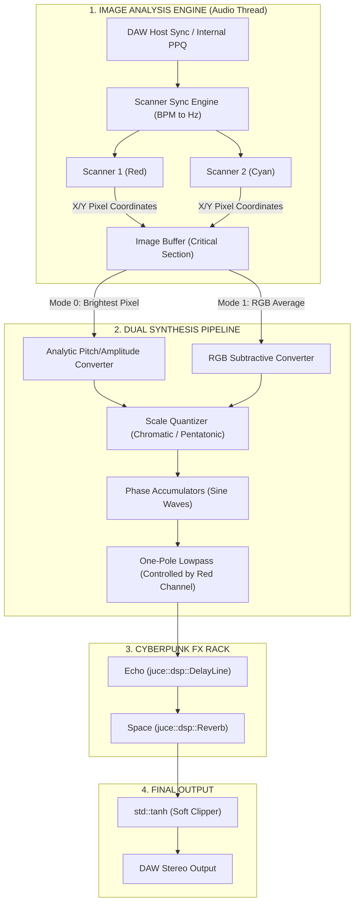

# 🔬 EXTASIS VISION v2.0 — DETAILED SIGNAL & DSP ARCHITECTURE SPECIFICATION

This document provides a comprehensive technical breakdown of the audio signal flow, DSP processing blocks, threading topology, and Sync routing engine inside **Extasis Vision**.

---

## 🗺️ High-Level Signal Flow Diagram

## 1. Drag & Drop and Threading
- **Message Thread**: Handles UI events, Drag & Drop (`filesDropped`). Images are loaded into a `juce::Image` and scaled down.
- **Audio Thread**: `processBlock` reads the `juce::Image`.
- **Synchronization**: A `juce::CriticalSection` (imageLock) prevents read/write race conditions between threads.

## 2. Sync & Polyrhythms
The scanners can operate in two time domains:
- **Free (Hz)**: Independent phase progression.
- **BPM Sync**: Derived from `AudioPlayHead::getPosition()`. `scanPositionX` becomes a direct mapping of `std::fmod(ppqPosition, beatDivisions)`.

## 3. Subtractive Synthesis Mode
- **Green**: Mapped to Pitch (Y-axis equivalent).
- **Blue**: Mapped to Amplitude.
- **Red**: Controls the coefficient of a One-Pole lowpass filter to sculpt tone.

## 4. License Management
- Handled offline via `LicenseManager.h`.
- Serial format: `EXTV-XXXX-XXXX-XXXX-XXXX`.
- Validated mathematically using a seeded hash generator and salt verification. Evaluated on plugin startup and loaded into an atomic boolean `isLicensedCached`.
